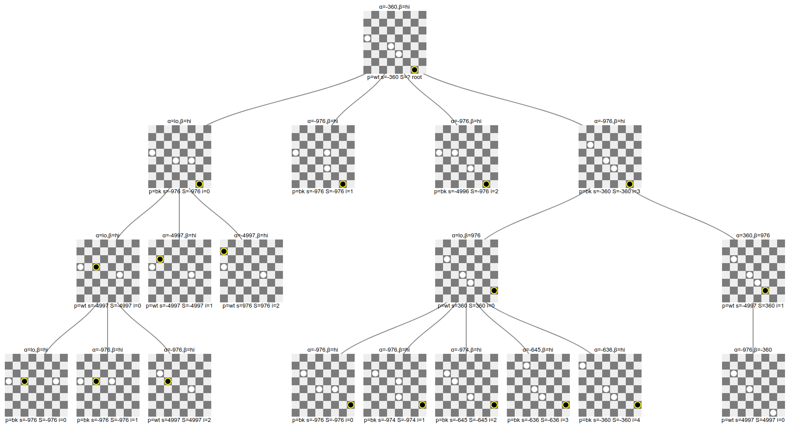
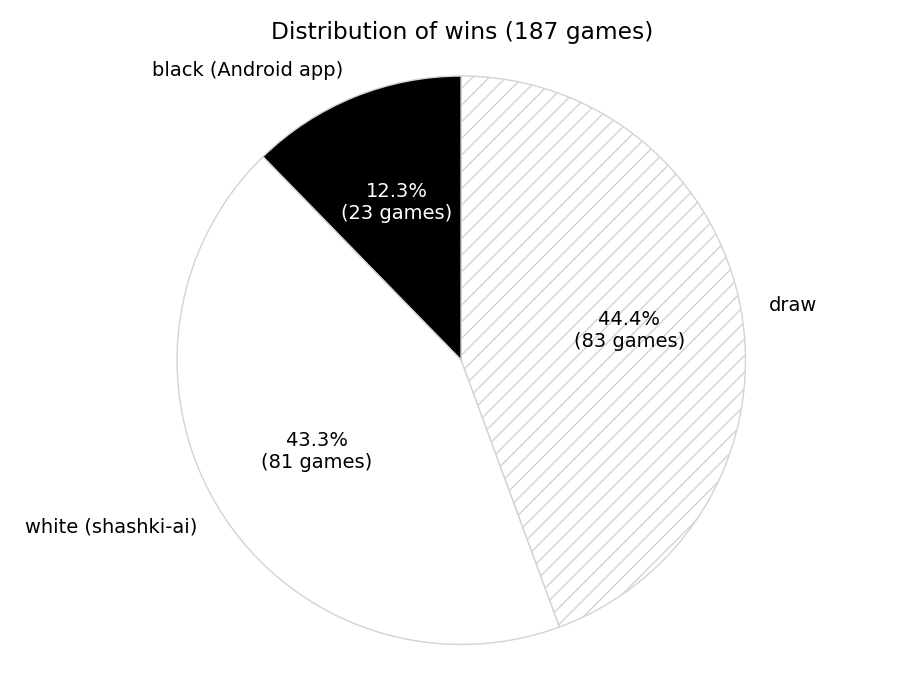
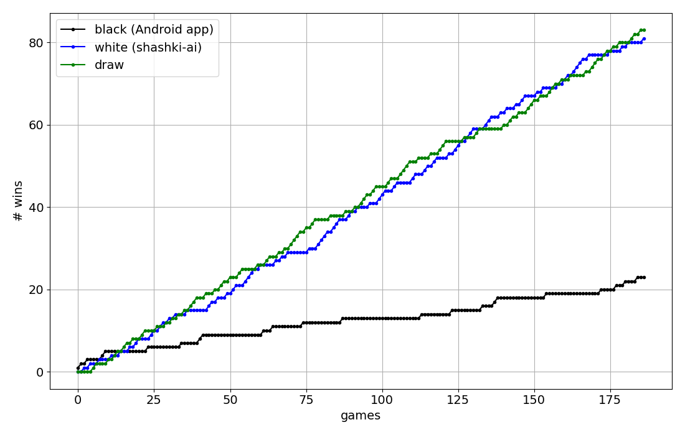

# AI for Playing Russian Checkers (aka "Shashki")
The code plays [Russian Checkers](https://en.wikipedia.org/wiki/Russian_draughts) (see
[official rules](https://fmjd64.org/rules-of-the-game/)) against a popular [Android
App](https://play.google.com/store/apps/details?id=com.checkersland.android.russian&hl=en_US&gl=US)
with the same name (500k+ installs, 4.3 stars). Below we refer to this app as the
"Android app".

The original motivation of the project was to beat that app on the most difficult level
(called "very hard"). This goal was achieved in that the present AI's typically winning
about 43% of the games while losing around 12% to the Android app; the remaining 45% are
a draw. Please note that despite this specific goal the AI is not tied in any way to
play against this specific app and it can be used to compute optimal moves using any
API/front end.

At engine level there's nothing fancy there. I had two goals in mind: i) gain in-depth
understanding of how game tree search works and ii) create a solid and performant
baseline for later experiments with Reinforcement Learning (RL). The code is fairly
modular and the core parts are well tested, so please hack away, experiment, improve, or
extend anything. And when done, don't forget to send a PR!

The code is based on the classic [Negamax](https://en.wikipedia.org/wiki/Negamax)
algorithm with alpha-beta pruning, or in other words an efficient version of [Minimiax
search](https://en.wikipedia.org/wiki/Minimax). Negamax and Minimax are equivalent in
terms of their results however Negamax takes only about the square root of the time a
Minimax search would. There's a large number of other optimizations such as move
ordering (transposition tables, killer moves, static ordering), Negamax enhancements
(windowing, MTD-f, principal variation search, ...), or opening books/endgame databases.
While these certainly were interesting to see at work, going forward it'll probably be
more exciting to take the modern RL path (see below).

The core engine is written standard C++ and builds on a highly space and time efficient
representation of the board, enabling fast gameplay. Playing out an entire game using
random moves takes between 15 and 16 μs, allowing for about 65'000 games/s (wall clock
time, i7-8700K CPU, single core, clang with `-Ofast -march=native`). Please note that
speed is mission critical here since good gameplay mainly derives from how deep into the
game tree one can search and, to a lesser extent, the quality of the evaluation
function.

Mostly for debugging and possibly of some pedagogical value, there's the option to
visualize and interactively explore the game tree in your browser for any given board.

The code was developed and tested on Ubuntu but it shouldn't be hard to port it to MS
Windows or macOS. At least there's no platform-dependent hacks, promise!


## Components and Folder Structure
The project contains a number of multiple, loosly coupled components:
* AI engine: C++ 17 sources in `src/`, headers in `include/`; exposes functionality
  through a REST API
* Code generator: Python sources in `python/codegen`; generates C++ code for core
  functionality; tested against a manual implementations with identical specs; writes
  the generated sources directly to `/src/generated`
* Driver code for Android app: Python sources in `python/gameplay`; reads the Android
  app's screen through ADB (Android Debug Bridge) and drives gameplay; fetches moves
  from the AI engine through its REST API; allows for continuosly playing games,
  recording of results and basic analysis
* Game tree visualization: HTML/CSS/JS sources in `web`; simple page using d3.js for
  rendering the tree; shows the details such as player, current board value, alpha-beta
  window, and pruning state for every board

Note that the engine's REST API allows components such as the front-end, the
visualization, or any future clients to run queries using simple HTTP `GET` requests.
For a detailed description of the API, please see `include/rest_api.h`.


## Running the Code
The steps below assume that you're on an Linux-based system. Adapting them for other
platforms should be straightforward though.

### Build and Run the Engine
1) Install [CMake](https://cmake.org/download/) 3.9 or later

2) Install a recent C++ compiler such as [LLVM/clang](https://apt.llvm.org/). For
   compilers other than `clang++-10` you'll want to set `CMAKE_CXX_COMPILER` in
   `CMakeLists.txt` accordingly. Please note that there's a single evaluation function
   (called `vfunc_external_1()`, declared in `include/valuation.h`) which is provided in
   binary form only. It's been compiled with clang which means that your compiler will
   have to be
   [ABI](https://en.wikipedia.org/wiki/Application_binary_interface)-compatible with
   clang (e.g., w.r.t. [name
   mangling](https://en.wikipedia.org/wiki/Name_mangling#How_different_compilers_mangle_the_same_functions)).
   In case this is not feasible for you, please replace all usages of
   `vfunc_external_1()` with, e.g., `vfunc_basic()`. Everything will work the same,
   except the AI will come up with somewhat inferior moves.

3) Build and install [Pistache](https://github.com/pistacheio/pistache). We need it to
   run our REST service. When done edit `CMakeLists.txt` and have `Pistache_DIR` point
   to the install location

4) From the root directory, run
   ```
   rm -fr build && mkdir build && cd build
   cmake -DCMAKE_BUILD_TYPE=Release .. && make clean && make -j12
   ```
   The build should complete without any errors or warnings

5) (optional) Now you may want to
   * Run all tests: `./shashki_ai test`
   * Time the code on your system: `./shashki_ai time`. This will play
     100k games and take a couple of seconds. Other processes (especially video decoding
     from e.g. YouTube will affect this number since it measures wall clock time)

6) To start the AI server, type `./shashki_ai serve`. The engine will be listening on
   `localhost:9080`


### Get Android Device Ready
Now we will fire up the Python client. It will control the Android app through
[ADB](https://developer.android.com/studio/command-line/adb), retrieve the moves from
the REST API and execute them.

1) Install the Android SDK. There's at least two options:
   * The bare minimum is to install the [Android SDK Platform
     Tools](https://developer.android.com/studio/releases/platform-tools); this will
     allow you to create a virtual device and run it from the command line. In case you
     don't have much experience with this, probably the following option will be
     preferable
   * Install [Android Studio](https://developer.android.com/studio). It will fetch the
     SDK tools automatically on the first launch. Also, Android Studio will come with
     the AVD Manager (start it from a button in the top right corner in the IDE). Use
     this GUI to create and start a virtual Android device. Alternatively you may
     connect a physical Android device via USB, though that connection might be somewhat
     slower

2) Directly using the Play store of the Android device, you now want to fetch the
   [Russian Checkers
   App](https://play.google.com/store/apps/details?id=com.checkersland.android.russian&hl=en_US&gl=US)
   app. Start a new game. It's really important that you play white and run in
   "Tournament Mode" (use checkbox). This is a simplification from the driver
   code while the engine doesn't mind what color you play


### Run the Client
1) Setup a Python environment: the code has been run on Python 3.8.5 however it should
   work with any Python 3.5+. Typing
   ```
   pip install -r requirements.txt
   ```
   from the `python` sub-folder should to get you started the most important packages.
   Possibly you'll manually have to add another package or two. Being this unspecific
   helps to reduce pollution in non-managed (i.e. non-conda-like) environments

2) Open a fresh terminal, optionally activate your Python environment, then `cd` into
   `python/gameplay`. In case `adb` is not yet in your `PATH`, update `PATH`
   accordingly. Then launch the driver app by typing `python main.py`

Now you should see the two AIs play against each other--remember to support white ;)
After each game the driver app resets the board and initiates a new game. The result of
the game will be appended to `python/gameplay/out/tournament_results.json`. To visualize
the results you may run `python plot_tournament_results.py` in the `gameplay` directory.


### Visualizing the Game Tree
Assuming the game server has been started as described above, you can visualize the game
tree and explore it interactively simply by opening `web/tree_viz/index.html` in your
browser of choice (tested on Chrome on Firefox). Just click the "Visualize" button.

The large numbers for black and white encode the board as described below. To encode an
arbitrary board you may want to use the helper workbook at `doc/board.ods`. In that
workbook, at the bottom, select the tab named "encoding". Cobble together your game
state by inserting numbers 1 through 4 in the top left board. Once you're happy just
take the two numbers for bk and wt in the box and copy-paste them on the visualization
page.

Eventually you should see something similar to this (click to enlage):<br>
<div align="center">
<a href="img/tree_viz.png"></a>
</div>


## Results
As a reference, below's the stats of a tournament where the AI (search depth 12) played
187 games against the Android app (at max difficulty). The AI significanlty outperformed
the Android app, winning 81 games while the Android app won 23.
<div align="center">
<a href="img/wins_pie_chart.png"></a>
&nbsp;&nbsp;
<a href="img/wins_over_time.png"></a>
</div>


## Implementation Details
**Conventions.**
* Throughout the code, black is the _maximizing_ player and always play from top to
  bottom. Internally, finding and executing moves for white uses the exact same
  operations but applied to a board which was flipped upside down (technically it's a
  reflection which is efficiently computable with bitwise operations)
* A _ply_ consists of all legal changes applied to the board before it's the other
  player's turn. Each ply corresponds to a level in the game tree.

**Board representation.** The 8x8 chessboard contains 32 dark squares which mark the valid
positions for any token. We index them as follows:
```
        0       1       2       3
    4       5       6       7
        8       9      10      11
   12      13      14      15
       16      17      18      19
   20      21      22      23
       24      25      26      27
   28      29      30      31
```
Each position may hold a man or a king while each of them can be black or white. Hence
we choose a [bitboard](https://en.wikipedia.org/wiki/Bitboard)-type of representation of
the board using two 64-bit integers (called a _slice_), one for black and one for white.
Such a slice stores the positions of men in its lower 32 bits while king positions
occupy the upper 32 bits.

**Move representation.** Similarly we represent a move with a single 16-bit integer by defining
```
move := ? ? ? t t t t t ? ? ? f f f f f
```
where the five `f` and the five `t` bits each encode a number in 0..31, indicating the
origin (`f` ~ from) and the destination (`t` ~ to), respectively.

**Actions.** The above choice of representation is a trade-off between efficiency and
usability. Despite highly optimized bitboard schemes exist, they are not straight-forward
to apply to the Russian variant of checkers, mainly due to flying kings. Our representation
allows for such moves while we can still express all operations using bitwise arithmetic.

**Code Generation.** We use Python to generate the code for four core functions,
* `std::vector<Move> valid_moves(...)`,
* `std::vector<Move> valid_capturing_moves_from(...)`,
* `bool do_move_bk(...)`,
* `bool do_move_wt(...)`,

all defined in `src/generated`. Despite code generation increases the build time
slighly, it proofed an effective tool for both avoiding bugs and writing code which an
optimizing compiler can translate into performant, native instructions.

This to get you started with internals. For details please refer to the code, a good
starting point may be `include/board.h`.


## Where To Go From Here
Given this reasonably strong baseline, it'll be interesting to try out different RL
techniques on this problem. As a start, you may want to write your own [OpenAI
Gym](https://gym.openai.com/) enviroment in Python and plug it into a framework/library
such as [tf_agents](https://www.tensorflow.org/agents),
[Ray](https://docs.ray.io/en/master/rllib.html), or
[keras-rl](https://github.com/keras-rl/keras-rl). This should help to get a first
impression on how far one can get with standard, discrete state space RL on this
problem. Some inspiration may be found e.g.
[here](https://docs.ray.io/en/latest/rllib-algorithms.html).

Personally I'd expect this to work well since the problem is completely deterministic
and most of the times the action space is manageable size. Only once kings start to show
up on the board, the cardinality of the action space may require some extra thought.

For a list of incremental improvements, please see <a
href="doc/improvements.md">`doc/improvements.md`</a>.

## Known Issues
* There's a minimal discrepancy between the game rules of the AI and Android app. When a
  man reaches the opponent's baseline via a capture it becomes a king who then shall
  continue capturing, if possible. For such continued captures the AI allows to capture
  in both possible directions, forward and also backwards on the path from where the
  baseline-reaching capture came from. By contrast the Android app only allow continued
  captures in the forward ("reflected") direction. The Android app's version is the
  correct one, putting the AI at a slight disadvantage
