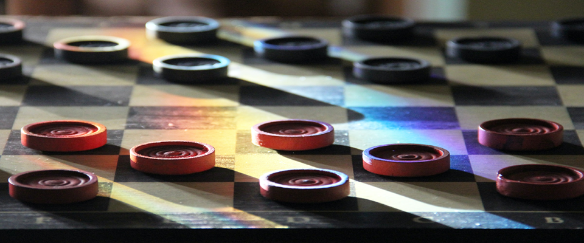

# AI for Playing Russian Checkers (aka "Shashki")
<div align="center">

<div style="text-align:end;font-size:11px;width:75%">Photo by Leonard Reese on Unsplash</div>
</div>
&nbsp;

The code plays [Russian Checkers](https://en.wikipedia.org/wiki/Russian_draughts) (see
[official rules](https://fmjd64.org/rules-of-the-game/)) against a popular [Android
App](https://play.google.com/store/apps/details?id=com.checkersland.android.russian&hl=en_US&gl=US)
of the same name (500k+ installs, 4.3 stars). Hereafter, we will refer to this app as
the "Android app."

The original motivation for this project was to defeat the app at its most difficult
level (called "very hard"). This goal has been achieved, with the AI typically winning
about 43% of the games while losing around 12% to the Android app; the remaining 45%
result in a draw. Please note that despite this specific goal, the AI is not limited to
playing against this particular app and can be used to compute optimal moves with any
API or front end.

At the engine level, there’s nothing particularly fancy. I had two objectives in mind:
i) to gain an in-depth understanding of how game tree search works, and ii) to create a
solid and efficient baseline for future experiments with Reinforcement Learning (RL).
The code is fairly modular, and the core components are well-tested, so feel free to
modify, experiment, improve, or extend anything. And when you're done, don't forget to
submit a PR!

The code is based on the classic [Negamax](https://en.wikipedia.org/wiki/Negamax)
algorithm with alpha-beta pruning, which is an efficient version of [Minimax
search](https://en.wikipedia.org/wiki/Minimax). Negamax and Minimax yield equivalent
results; however, Negamax typically requires only about the square root of the time that
a Minimax search would. There are numerous other optimizations, such as move ordering
(transposition tables, killer moves, static ordering), Negamax enhancements (windowing,
MTD-f, principal variation search, etc.), and opening books/endgame databases. While
these optimizations are interesting to observe, it may be more exciting to pursue modern
RL approaches moving forward (see below).

The core engine is written in standard C++ and utilizes a highly space- and
time-efficient representation of the board, enabling fast gameplay. Playing out an
entire game using random moves takes between 15 and 16 μs, allowing for approximately
65,000 games per second (wall clock time, i7-8700K CPU, single core, clang with `-Ofast
-march=native`). Please note that speed is critical here, as good gameplay primarily
depends on how deeply one can search the game tree, and to a lesser extent, the quality
of the evaluation function.

For debugging and potential pedagogical value, there is an option to visualize and
interactively explore the game tree in your browser for any given board.

The code was developed and tested on Ubuntu, but it should be straightforward to port it
to MS Windows or macOS. There are no platform-dependent hacks, I promise!


## Components and Folder Structure
The project consists of several loosely coupled components:
* AI engine: C++ 17 sources in `src/`, headers in `include/`; exposes functionality
  through a REST API.
* Code generator: Python sources in `python/codegen`; generates C++ code for core
  functionality; tested against a manual implementation with identical specs; writes the
  generated sources directly to `/src/generated`.
* Driver code for the Android app: Python sources in `python/gameplay`; reads the
  Android app's screen through ADB (Android Debug Bridge) and drives gameplay; fetches
  moves from the AI engine through its REST API; allows for continuous gameplay,
  recording of results, and basic analysis.
* Game tree visualization: HTML/CSS/JS sources in `web`; a simple page using d3.js for
  rendering the tree; displays details such as player, current board value, alpha-beta
  window, and pruning state for each board.

Note that the engine's REST API allows components such as the front end, visualization,
or any future clients to run queries using simple HTTP `GET` requests. For a detailed
description of the API, please see `include/rest_api.h`.


## Running the Code
The steps below assume you are on a Linux-based system. Adapting them for other
platforms should be straightforward.

### Build and Run the Engine
1) Install [CMake](https://cmake.org/download/) version 3.9 or later.

2) Install a recent C++ compiler such as [LLVM/clang](https://apt.llvm.org/). For
   compilers other than `clang++-10`, you will need to set `CMAKE_CXX_COMPILER` in
   `CMakeLists.txt` accordingly. Please note that there is a single evaluation function
   (called `vfunc_external_1()`, declared in `include/valuation.h`) which is provided in
   binary form only. It has been compiled with clang, meaning your compiler must be
   [ABI](https://en.wikipedia.org/wiki/Application_binary_interface)-compatible with
   clang (e.g., regarding [name
   mangling](https://en.wikipedia.org/wiki/Name_mangling#How_different_compilers_mangle_the_same_functions)).
   If this is not feasible, please replace all instances of `vfunc_external_1()` with,
   for example, `vfunc_basic()`. Everything will function the same, except the AI will
   generate somewhat inferior moves.

3) Build and install [Pistache](https://github.com/pistacheio/pistache). We need it to
   run our REST service. Clone the repo into this project's base at `pistache`.
   Currently, we build against Pistache version 0.2.9.20240428. If Pistache's root
   directory is located elsewhere on your system, remember to edit the Pistache section
   in `CMakeLists.txt` to set the include and library locations accordingly.

4) From the root directory, run
   ```
   rm -fr build && mkdir build && cd build
   cmake -DCMAKE_BUILD_TYPE=Release .. && make clean && make -j12
   ```
   The build should complete without any errors or warnings.

5) (optional) You may want to
   * Run all tests: `./shashki_ai test`
   * Time the code on your system: `./shashki_ai time`. This will play 100k games and
     take a few seconds. Other processes (especially video decoding from sources like
     YouTube) will affect this measurement since it records wall clock time.

6) To start the AI server, type `./shashki_ai serve`. The engine will listen on
   `localhost:9080`.


### Prepare the Android Device
Now we will launch the Python client. It will control the Android app through
[ADB](https://developer.android.com/studio/command-line/adb), retrieve moves from the
REST API, and execute them.

1) Install the Android SDK. There are at least two options:
   * The bare minimum is to install the [Android SDK Platform
     Tools](https://developer.android.com/studio/releases/platform-tools); this will
     allow you to create a virtual device and run it from the command line. If you lack
     experience with this, the following option may be preferable.
   * Install [Android Studio](https://developer.android.com/studio). It will
     automatically fetch the SDK tools on the first launch. Additionally, Android Studio
     includes the AVD Manager (accessible via a button in the top right corner of the
     IDE). Use this GUI to create and start a virtual Android device. Alternatively, you
     may connect a physical Android device via USB, though that connection may be
     somewhat slower.

2) Using the Play Store on the Android device, download the [Russian Checkers
   App](https://play.google.com/store/apps/details?id=com.checkersland.android.russian&hl=en_US&gl=US).
   Start a new game. It is crucial that you play as white and enable "Tournament Mode"
   (use the checkbox). This is a simplification in the driver code, while the engine
   does not care about the color you play.


### Run the Client
1) Set up a Python environment: the code has been tested on Python 3.8.5, but it should
   work with any Python version 3.5 or higher. Run
   ```
   pip install -r requirements.txt
   ```
   from the `python` sub-folder to install the most important packages. You may need to
   manually add another package or two. This generality helps reduce pollution in
   non-managed (i.e., non-conda-like) environments.

2) Open a new terminal, optionally activate your Python environment, then `cd` into
   `python/gameplay`. If `adb` is not yet in your `PATH`, update `PATH` accordingly.
   Then launch the driver app by typing `python main.py`.

Now you should see the two AIs play against each other—remember to support white! After
each game, the driver app resets the board and initiates a new game. The result of each
game will be appended to `python/gameplay/out/tournament_results.json`. To visualize the
results, you can run `python plot_tournament_results.py` in the `gameplay` directory.


### Visualizing the Game Tree
Assuming the game server has been started as described above, you can visualize the game
tree and explore it interactively by simply opening `web/tree_viz/index.html` in your
browser of choice (tested on Chrome and Firefox). Just click the "Visualize" button.

The large numbers for black and white encode the board as described below. To encode an
arbitrary board, you may want to use the helper workbook at `doc/board.ods`. In that
workbook, select the tab named "encoding" at the bottom. Assemble your game state by
inserting numbers 1 through 4 in the top left board. Once you're satisfied, just take
the two numbers for bk and wt in the box and copy-paste them on the visualization page.

Eventually, you should see something similar to this (click to enlarge):<br>
<div align="center">
<a href="img/tree_viz.png"></a>
</div>


## Results
As a reference, below are the stats from a tournament where the AI (search depth 12)
played 187 games against the Android app (at maximum difficulty). The AI significantly
outperformed the Android app, winning 81 games while the Android app won 23.
<div align="center">
<a href="img/wins_pie_chart.png"></a>
&nbsp;&nbsp;
<a href="img/wins_over_time.png"></a>
</div>

// TODO: add Elo scores

## Implementation Details
**Conventions.**
* Throughout the code, black is the _maximizing_ player and always plays from top to
  bottom. Internally, finding and executing moves for white uses the same operations but
  applies them to a board that has been flipped upside down (technically, it's a
  reflection that can be efficiently computed with bitwise operations).
* A _ply_ consists of all legal changes applied to the board before it becomes the other
  player's turn. Each ply corresponds to a level in the game tree.

**Board representation.** The 8x8 chessboard contains 32 dark squares that mark the
valid positions for any token. We index them as follows:
```
        0       1       2       3
    4       5       6       7
        8       9      10      11
   12      13      14      15
       16      17      18      19
   20      21      22      23
       24      25      26      27
   28      29      30      31
```
Each position may hold a man or a king, and each can be either black or white. Thus, we
use a [bitboard](https://en.wikipedia.org/wiki/Bitboard)-type representation of the
board, utilizing two 64-bit integers (called a _slice_), one for black and one for
white. Each slice stores the positions of men in its lower 32 bits, while king positions
occupy the upper 32 bits.

**Move representation.** Similarly, we represent a move with a single 16-bit integer
defined as
```
move := ? ? ? t t t t t ? ? ? f f f f f
```
where the five `f` and the five `t` bits each encode a number in 0..31, indicating the
origin (`f` ~ from) and the destination (`t` ~ to), respectively.

**Actions.** This choice of representation is a trade-off between efficiency and
usability. While highly optimized bitboard schemes exist, they are not straightforward
to apply to the Russian variant of checkers, mainly due to flying kings. Our
representation allows for such moves while still enabling all operations to be expressed
using bitwise arithmetic.

**Code Generation.** We use Python to generate the code for four core functions:
* `std::vector<Move> valid_moves(...)`,
* `std::vector<Move> valid_capturing_moves_from(...)`,
* `bool do_move_bk(...)`,
* `bool do_move_wt(...)`,

all defined in `src/generated`. Although code generation slightly increases build time,
it has proven to be an effective tool for avoiding bugs and writing code that an
optimizing compiler can translate into performant, native instructions.

This should help you get started with the internals. For more details, please refer to
the code; a good starting point may be `include/board.h`.


## Where To Go From Here
Given this reasonably strong baseline, it will be interesting to experiment with
different RL techniques on this problem. As a starting point, you may want to create
your own [OpenAI Gym](https://gym.openai.com/) environment in Python and integrate it
into a framework/library such as [tf_agents](https://www.tensorflow.org/agents),
[Ray](https://docs.ray.io/en/master/rllib.html), or
[keras-rl](https://github.com/keras-rl/keras-rl). This should provide a first impression
of how far one can progress with standard, discrete state space RL on this problem. Some
inspiration can be found, for example,
[here](https://docs.ray.io/en/latest/rllib-algorithms.html).

Personally, I expect this to work well since the problem is completely deterministic
and, most of the time, the action space is manageable in size. Only when kings start to
appear on the board does the cardinality of the action space require some extra
consideration.

For a list of incremental improvements, please see <a
href="doc/improvements.md">`doc/improvements.md`</a>.

## Known Issues
* There is a minor discrepancy between the game rules of the AI and the Android app.
  When a man reaches the opponent's baseline via a capture, it becomes a king and must
  continue capturing, if possible. For such continued captures, the AI allows capturing
  in both possible directions—forward and backward along the path from which the
  baseline-reaching capture originated. In contrast, the Android app only allows
  continued captures in the forward ("reflected") direction. The Android app's version
  is the correct one, putting the AI at a slight disadvantage.
